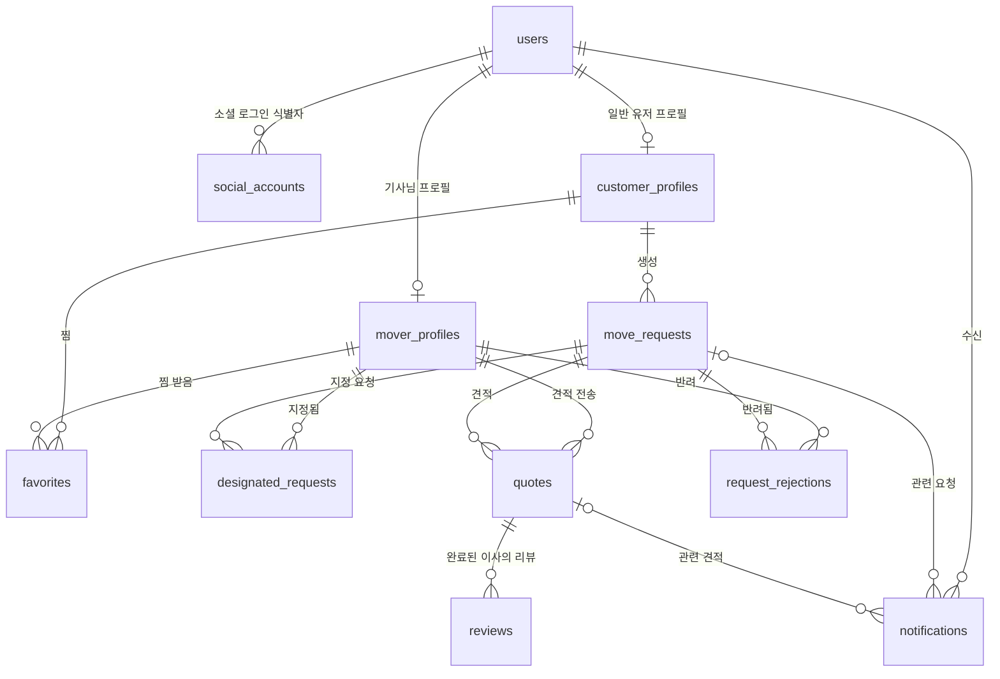

# 무빙 ERD

테이블과 관계의 개요입니다. 실제 DB 정의는 [`prisma/schema.prisma`](../../prisma/schema.prisma)와 [`prisma/migrations/`](../../prisma/migrations/)를 기준으로 합니다.

```mermaid
erDiagram
    users ||--o{ social_accounts : "소셜 로그인 식별자"
    users ||--o| customer_profiles : "일반 유저 프로필"
    users ||--o| mover_profiles : "기사님 프로필"
    users ||--o{ notifications : "수신"
    customer_profiles ||--o{ move_requests : "생성"
    customer_profiles ||--o{ favorites : "찜"
    mover_profiles ||--o{ favorites : "찜 받음"
    mover_profiles ||--o{ designated_requests : "지정됨"
    mover_profiles ||--o{ quotes : "견적 전송"
    mover_profiles ||--o{ request_rejections : "반려"
    move_requests ||--o{ designated_requests : "지정 요청"
    move_requests ||--o{ quotes : "견적"
    move_requests ||--o{ request_rejections : "반려됨"
    move_requests |o--o{ notifications : "관련 요청"
    quotes ||--o{ reviews : "완료된 이사의 리뷰"
    quotes |o--o{ notifications : "관련 견적"
```
